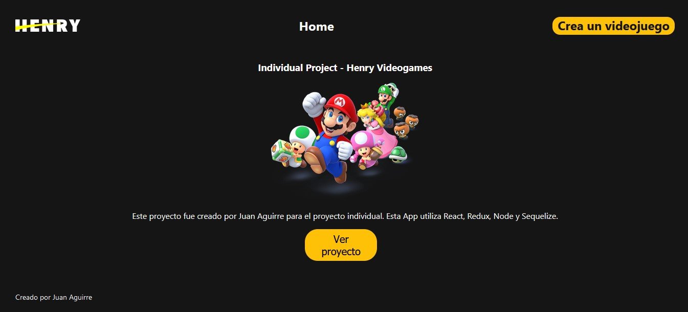
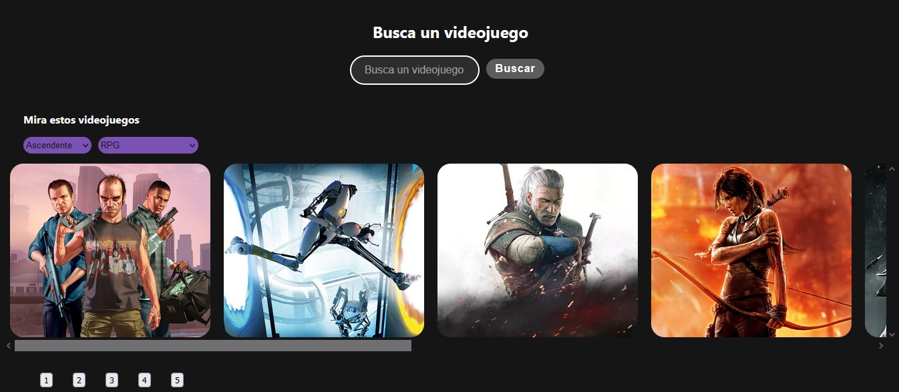
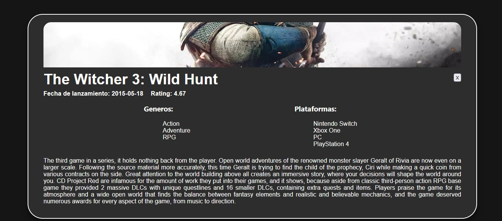

<p align='left'>
    
</p>

# Videogames App

<p align="right">
  
</p>

Videogames App es una SPA (Single Page Application) en la que se puede ver distintos videojuegos con su información utilizando la API [RAWG](https://rawg.io/).

Utilicé React para el Front End y Redux como state management. Todos los componentes fueron desarrollados con Sass.
La SPA consume los datos de [RAWG](https://rawg.io/) a través de un Back End desarrollado en Node.JS
utilizando Express, agregando nuevas funcionalidades a la API original.

Algunas funcionalidades del proyecto: 
- Input de búsqueda de videojuegos por nombre
- Ordenamientos y filtros
- Formulario controlado para crear un videojuego
- Botón para ver los detalles del videojuego 
- Agregar videojuegos a la sección favoritos.

## Levantar el proyecto 🚀

Clonar el repositorio y posicionarse en la carpeta /client.

Crear un archivo .env y agregar la siguiente variable:

```
REACT_APP_API=https://videogames--app.herokuapp.com/api
```

Luego ingresar:

```
npm install
```

```
npm start
```

Con esto, el proyecto debería estar corriendo en el puerto 3000. No es necesario levantar el back ya que se encuentra deployado.

**Tests**

El proyecto cuenta con tests tanto en /api y en /client. Solamente hay que posicionarse en la carpeta e ingresar:

```
npm test
```


<h2 align="center" > Landing <h2/>
<p align="center" >
    
<p />
    
<h2 align="center"> Home <h2/>
<p align="center" >
    
<p />
    
<h2 align="center"> Detail <h2/>
<p align="center">  
    
<p />


## Objetivos del Proyecto

- Construir una App utlizando React, Redux, Node y Sequelize.
- Afirmar y conectar los conceptos aprendidos en la carrera.
- Aprender mejores prácticas.
- Aprender y practicar el workflow de GIT.
- Usar y practicar testing.

## Horarios y Fechas

El proyecto tendrá una duración máxima de tres semanas. En el caso de que completan todas las tareas antes de dicho lapso podrán avisar a su Instructor para coordinar una fecha de presentación del trabajo (DEMO).

## Comenzando

 1. Se debe iniciar git con `git init`
 2. Crear en su cuenta de GitHub un nuevo repo con el nombre `PI-Videogames-FT__` donde `__` es el numero de cohorte en el que estas
 3. Hacer un commit inicial ej: `git add .` => `git commit -m "init"` => `git branch -M main`
 4. Seguir las instrucciones de GitHub para 'conectar' su repositorio local con GitHub `git remote add........`
 5. Hacer push de ese commit `git push -u origin main`
 6. No olvidar que deben regularmente hacer commit y push para mantener el repo actualizado en la nube

Tendrán un `boilerplate` con la estructura general tanto del servidor como de cliente.

__IMPORTANTE:__ Es necesario contar minimamente con la última versión estable de Node y NPM. Asegurarse de contar con ella para poder instalar correctamente las dependecias necesarias para correr el proyecto.

## BoilerPlate

El boilerplate cuenta con dos carpetas: `api` y `client`. En estas carpetas estará el código del back-end y el front-end respectivamente.

En `api` crear un archivo llamado: `.env` que tenga la siguiente forma:

```
DB_USER=usuariodepostgres
DB_PASSWORD=passwordDePostgres
DB_HOST=localhost
```

Reemplazar `usuariodepostgres` y `passwordDePostgres` con tus propias credenciales para conectarte a postgres. Este archivo va ser ignorado en la subida a github, ya que contiene información sensible (las credenciales).

Adicionalmente será necesario que creen desde psql una base de datos llamada `videogames`

El contenido de `client` fue creado usando: Create React App.

## Enunciado

La idea general es crear una aplicación en la cual se puedan ver los distintos videojuegos disponibles junto con información relevante de los mismos utilizando la api externa [rawg](https://rawg.io/apidocs) y a partir de ella poder, entre otras cosas:

  - Buscar videjuegos
  - Filtrarlos / Ordenarlos
  - Agregar nuevos videojuegos

__IMPORTANTE__: Para poder utilizar esta API externa es necesario crearse una cuenta para obtener una API Key que luego debera ser incluida en todos los request que hagamos a rawg simplemente agregando `?key={YOUR_API_KEY}` al final de cada endpoint. Agregar la clave en el archivo `.env` para que la misma no se suba al repositorio por cuestiones de seguridad y utilizarla desde allí.

__IMPORTANTE__: Para las funcionalidades de filtrado y ordenamiento NO pueden utilizar los endpoints de la API externa que ya devuelven los resultados filtrados u ordenados sino que deben realizarlo ustedes mismos. En particular alguno de los ordenamientos o filtrados debe si o si realizarse desde el frontend.

### Únicos Endpoints/Flags que pueden utilizar

  - GET https://api.rawg.io/api/games
  - GET https://api.rawg.io/api/games?search={game}
  - GET https://api.rawg.io/api/genres
  - GET https://api.rawg.io/api/games/{id}

### Requerimientos mínimos:

A continuación se detallaran los requerimientos mínimos para la aprobación del proyecto individial. Aquellos que deseen agregar más funcionalidades podrán hacerlo. En cuanto al diseño visual no va a haber wireframes ni prototipos prefijados sino que tendrán libertad de hacerlo a su gusto pero tienen que aplicar los conocimientos de estilos vistos en el curso para que quede agradable a la vista.

__IMPORTANTE__: No se permitirá utilizar librerías externas para aplicar estilos a la aplicación. Tendrán que utilizar CSS con algunas de las opciones que vimos en dicha clase (CSS puro, CSS Modules o Styled Components)

#### Tecnologías necesarias:
- [ ] React
- [ ] Redux
- [ ] Express
- [ ] Sequelize - Postgres

#### Frontend

Se debe desarrollar una aplicación de React/Redux que contenga las siguientes pantallas/rutas.

__Pagina inicial__: deben armar una landing page con
- [ ] Alguna imagen de fondo representativa al proyecto
- [ ] Botón para ingresar al home (`Ruta principal`)

__Ruta principal__: debe contener
- [ ] Input de búsqueda para encontrar videojuegos por nombre
- [ ] Área donde se verá el listado de videojuegos. Deberá mostrar su:
  - Imagen
  - Nombre
  - Géneros
- [ ] Botones/Opciones para filtrar por género y por videojuego existente o agregado por nosotros
- [ ] Botones/Opciones para ordenar tanto ascendentemente como descendentemente los videojuegos por orden alfabético y por rating
- [ ] Paginado para ir buscando y mostrando los siguientes videojuegos

__IMPORTANTE__: Dentro de la Ruta Principal se deben mostrar tanto los videjuegos traidos desde la API como así también los de la base de datos. Debido a que en la API existen alrededor de 500 mil juegos, por cuestiones de performance pueden tomar la simplificación de obtener y paginar los primeras 100.

__Ruta de detalle de videojuego__: debe contener
- [ ] Los campos mostrados en la ruta principal para cada videojuegos (imagen, nombre, y géneros)
- [ ] Descripción
- [ ] Fecha de lanzamiento
- [ ] Rating
- [ ] Plataformas

__Ruta de creación de videojuegos__: debe contener
- [ ] Un formulario __controlado__ con los siguientes campos
  - Nombre
  - Descripción
  - Fecha de lanzamiento
  - Rating
- [ ] Posibilidad de seleccionar/agregar varios géneros
- [ ] Posibilidad de seleccionar/agregar varias plataformas
- [ ] Botón/Opción para crear un nuevo videojuego

#### Base de datos

El modelo de la base de datos deberá tener las siguientes entidades (Aquellas propiedades marcadas con asterísco deben ser obligatorias):

- [ ] Videojuego con las siguientes propiedades:
  - ID: * No puede ser un ID de un videojuego ya existente en la API rawg
  - Nombre *
  - Descripción *
  - Fecha de lanzamiento
  - Rating
  - Plataformas *
- [ ] Genero con las siguientes propiedades:
  - ID
  - Nombre

La relación entre ambas entidades debe ser de muchos a muchos ya que un videojuego puede pertenecer a varios géneros en simultaneo y, a su vez, un género puede contener múltiples videojuegos distintos. Un ejemplo sería el juego `Counter Strike` pertenece a los géneros Shooter y Action al mismo tiempo. Pero a su vez existen otros videojuegos considerados como Shooter o como Action.

__IMPORTANTE__: Pensar como modelar los IDs de los videojuegos en la base de datos. Existen distintas formas correctas de hacerlo pero tener en cuenta que cuando hagamos click en algun videojuego, este puede provenir de la API o de la Base de Datos por lo que cuando muestre su detalle no debería haber ambigüedad en cual se debería mostrar. Por ejemplo si en la API el videojuego `Age of Empires II: Age of Kings` tiene id = 1 y en nuestra base de datos creamos un nuevo videojuego `Age of Henry` con id = 1, ver la forma de diferenciarlos cuando querramos acceder al detalle del mismo.

#### Backend

Se debe desarrollar un servidor en Node/Express con las siguientes rutas:

__IMPORTANTE__: No está permitido utilizar los filtrados, ordenamientos y paginados brindados por la API externa, todas estas funcionalidades tienen que implementarlas ustedes.

- [ ] __GET /videogames__:
  - Obtener un listado de los primeras 15 videojuegos
  - Debe devolver solo los datos necesarios para la ruta principal
- [ ] __GET /videogames?name="..."__:
  - Obtener un listado de las primeros 15 videojuegos que contengan la palabra ingresada como query parameter
  - Si no existe ningún videojuego mostrar un mensaje adecuado
- [ ] __GET /videogame/{idVideogame}__:
  - Obtener el detalle de un videojuego en particular
  - Debe traer solo los datos pedidos en la ruta de detalle de videojuego
  - Incluir los géneros asociados
- [ ] __GET /genres__:
  - Obtener todos los tipos de géneros de videojuegos posibles
  - En una primera instancia deberán traerlos desde rawg y guardarlos en su propia base de datos y luego ya utilizarlos desde allí
- [ ] __POST /videogame__:
  - Recibe los datos recolectados desde el formulario controlado de la ruta de creación de videojuego por body
  - Crea un videojuego en la base de datos


#### Testing
- [ ] Al menos tener un componente del frontend con sus tests respectivos
- [ ] Al menos tener una ruta del backend con sus tests respectivos
- [ ] Al menos tener un modelo de la base de datos con sus tests respectivos
